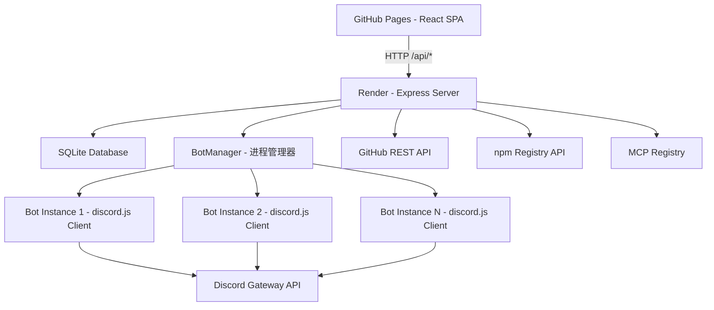
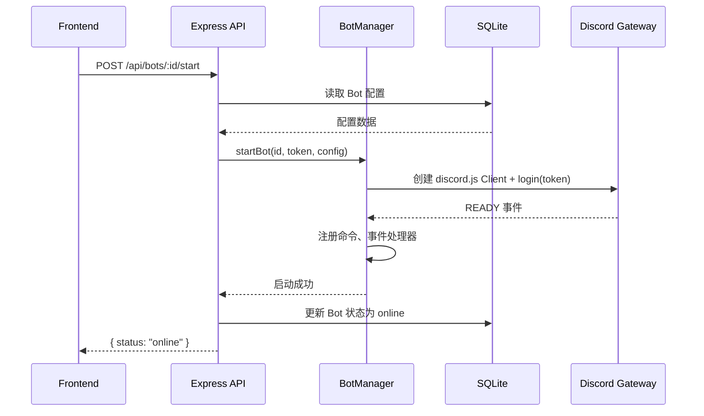
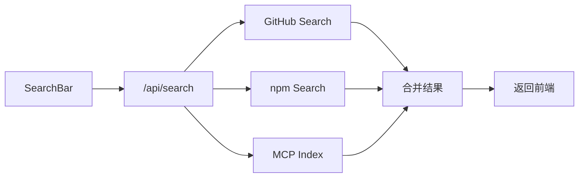

# Discord Bot 工坊

Feature Name: discord-bot-workshop
Updated: 2026-07-21

## Description

Discord Bot 工坊是一个 Web 端 Discord 机器人可视化创建与管理平台。用户通过可视化界面创建和编辑 Bot 命令、Embed 消息、事件行为，后端直接托管运行 Bot 的 discord.js 客户端进程。平台内置跨 GitHub/npm/MCP 的项目搜索引擎，帮助用户发现可集成的新能力模块。

前端部署在 GitHub Pages，后端部署在 Render，前后端分离架构。

## Architecture



**数据流说明：**

1. 前端 SPA 通过 `/api/*` 调用后端 REST API
2. 后端 BotManager 管理多个 discord.js Client 实例，每个实例对应一个用户创建的 Bot
3. Bot 配置持久化在 SQLite 中，后端启动时自动恢复
4. 搜索功能由后端代理请求 GitHub/npm/MCP 外部 API

## Components and Interfaces

### 1. Frontend (React + Vite + TailwindCSS)

部署目标：GitHub Pages（静态站点）

**页面路由：**

| 路由 | 页面 | 功能 |
|------|------|------|
| `/` | 首页/Bot 列表 | 展示所有 Bot，创建入口 |
| `/bot/:id` | Bot 编辑页 | 命令编辑、Embed 编辑、事件配置 |
| `/bot/:id/commands` | 命令列表 | 斜杠命令 CRUD |
| `/bot/:id/events` | 事件配置 | 欢迎消息、关键词回复 |
| `/search` | 项目搜索 | 跨 GitHub/npm/MCP 搜索 |
| `/server` | 社区面板 | 服务器信息概览 |

**核心组件：**

- `BotCard` - Bot 卡片（名称、头像、状态、操作按钮）
- `CommandEditor` - 命令编辑表单（名称、描述、参数、回复）
- `EmbedBuilder` - Embed 可视化构建器 + 实时预览
- `EventConfig` - 事件配置面板（事件类型选择、频道选择、内容编辑）
- `SearchBar` - 统一搜索框 + 多源筛选
- `SearchResult` - 搜索结果卡片（GitHub Repo / npm Package / MCP Server）

### 2. Backend (Node.js + Express)

部署目标：Render Web Service

**API 端点：**

| 方法 | 路径 | 功能 |
|------|------|------|
| GET | `/api/bots` | 获取 Bot 列表 |
| POST | `/api/bots` | 创建 Bot（含 Token 验证） |
| GET | `/api/bots/:id` | 获取 Bot 详情与配置 |
| PUT | `/api/bots/:id` | 更新 Bot 配置 |
| DELETE | `/api/bots/:id` | 删除 Bot |
| POST | `/api/bots/:id/start` | 启动 Bot |
| POST | `/api/bots/:id/stop` | 停止 Bot |
| POST | `/api/bots/:id/restart` | 重启 Bot |
| GET | `/api/bots/:id/commands` | 获取命令列表 |
| POST | `/api/bots/:id/commands` | 创建命令 |
| PUT | `/api/bots/:id/commands/:cmdId` | 更新命令 |
| DELETE | `/api/bots/:id/commands/:cmdId` | 删除命令 |
| GET | `/api/bots/:id/events` | 获取事件配置 |
| PUT | `/api/bots/:id/events` | 更新事件配置 |
| GET | `/api/search?q=&source=&lang=` | 项目搜索 |
| GET | `/api/server/:id/info` | 获取服务器信息 |

### 3. BotManager (核心模块)

负责管理多个 discord.js Client 实例的生命周期：



**BotManager 职责：**
- 维护 `Map<botId, Client>` 管理所有运行中的 Bot 实例
- 启动时从 SQLite 读取所有 Bot 配置，自动恢复运行中的 Bot
- 监听 discord.js Client 事件（ready、error、disconnect）
- Bot 异常断开时自动重连
- 提供 start/stop/restart/getStatus 方法

### 4. 项目搜索引擎



- GitHub 搜索：调用 `GET https://api.github.com/search/repositories?q=discord+bot+<keyword>&sort=stars`
- npm 搜索：调用 `GET https://registry.npmjs.org/-/v1/search?text=discord+<keyword>`
- MCP 搜索：使用 MCP Registry API 或腾讯云 MCP 广场数据进行索引

## Data Models

### Bot

```typescript
interface Bot {
  id: string;           // UUID
  name: string;         // Bot 名称
  avatar?: string;      // 头像 URL
  token: string;        // Discord Bot Token (加密存储)
  status: 'offline' | 'online' | 'starting' | 'error';
  clientId?: string;    // Discord Application Client ID
  guildId?: string;     // 服务器 ID
  commands: Command[];
  events: EventConfig[];
  createdAt: string;
  updatedAt: string;
}
```

### Command

```typescript
interface Command {
  id: string;
  name: string;
  description: string;
  options: CommandOption[];
  reply: ReplyConfig;
}

interface CommandOption {
  name: string;
  description: string;
  type: 'STRING' | 'INTEGER' | 'BOOLEAN' | 'USER' | 'CHANNEL' | 'ROLE';
  required: boolean;
}

interface ReplyConfig {
  type: 'text' | 'embed';
  content?: string;      // 纯文本回复
  embeds?: EmbedConfig[]; // Embed 回复
}
```

### EmbedConfig

```typescript
interface EmbedConfig {
  title?: string;
  description?: string;
  color?: string;        // 十六进制颜色
  thumbnail?: string;    // 缩略图 URL
  image?: string;        // 大图 URL
  footer?: string;
  fields?: { name: string; value: string; inline: boolean }[];
}
```

### EventConfig

```typescript
interface EventConfig {
  type: 'memberJoin' | 'messageCreate' | 'memberLeave';
  enabled: boolean;
  config: MemberJoinConfig | MessageCreateConfig | MemberLeaveConfig;
}

interface MemberJoinConfig {
  channelId: string;
  message: string;       // 支持 {user} 占位符
}

interface MessageCreateConfig {
  keywords: { pattern: string; reply: string }[];
}
```

### SearchResult

```typescript
interface SearchResult {
  source: 'github' | 'npm' | 'mcp';
  name: string;
  description: string;
  url: string;
  stars?: number;
  language?: string;
  license?: string;
  installCommand?: string;
}
```

## Correctness Properties

1. **Token 安全**: Bot Token 在数据库中必须加密存储，API 响应中不返回原始 Token
2. **Bot 实例隔离**: 每个 Bot 运行在独立 discord.js Client 中，一个 Bot 崩溃不影响其他 Bot
3. **配置持久化**: Bot 配置的每次修改必须即时写入 SQLite，服务重启后完整恢复
4. **命令注册幂等**: 多次启动同一 Bot 不会导致重复注册斜杠命令
5. **搜索降级**: 如果 GitHub API 超频，返回缓存结果或仅返回 npm 结果

## Error Handling

| 场景 | 处理策略 |
|------|----------|
| Bot Token 无效 | 创建时验证，返回明确错误提示 "Token 无效，请检查 Discord Developer Portal" |
| Bot 启动失败 | 前端展示错误信息，Bot 状态设为 error，提供重试按钮 |
| Discord API 限频 | discord.js 内置自动重试队列，前端不感知 |
| GitHub API 限频 (60次/时) | 返回缓存结果 + 提示 "GitHub 搜索已达限制，显示缓存结果" |
| Render 服务休眠 | 前端检测后端不可用时展示 "服务启动中，请稍候" 提示 |
| Bot 异常断开 | BotManager 自动重连（指数退避），状态更新为 reconnecting |

## Test Strategy

由于 Render 限制，测试策略聚焦于：

1. **后端单元测试**: BotManager 启动/停止逻辑、命令代码生成逻辑
2. **API 集成测试**: Bot CRUD 端点、搜索端点
3. **前端组件测试**: EmbedBuilder 渲染、CommandEditor 表单验证
4. **手动 E2E**: 创建 Bot → 编辑命令 → 启动 → 在 Discord 中验证 `/命令` 可用

## References

[^1]: discord.js Guide - https://discordjs.guide/
[^2]: Discord Developer Portal - https://discord.com/developers/applications
[^3]: GitHub Search API - https://docs.github.com/en/rest/reference/search
[^4]: npm Registry API - https://github.com/npm/registry/blob/master/docs/REGISTRY-API.md
[^5]: Render Docs - https://render.com/docs
[^6]: GitHub Pages Docs - https://docs.github.com/en/pages
